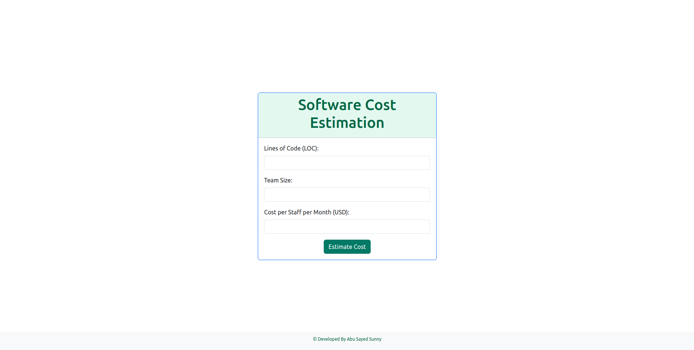

# Software-Cost-Estimation-Flask

The **Software Cost Estimation App** is a Flask web application that uses the COCOMO II model to estimate the cost of a software project based on the input provided by the user. This simple app allows users to input the Lines of Code (LOC), Team Size, and the Cost per Staff per Month (in USD) for the project. The app then calculates the estimated cost of the project and its duration in years, months, and days.



## How to Use

1. Clone the repository to your local machine:

```bash
git clone https://github.com/sunny-ai/software-cost-estimation-flask.git
```


2. Navigate to the project directory:

```bash
cd software-cost-estimation
```


3. Install the required dependencies using pip:

```bash
pip install flask
```


4. Run the Flask app:

```bash
python app.py
```


5. Open your web browser and go to http://127.0.0.1:5000/.

6. Fill in the required input fields:

    - **Lines of Code (LOC):** Enter the number of lines of code for your software project.
    
    - **Team Size:** Enter the number of people working on the project.
    
    - **Cost per Staff per Month (USD):** Enter the cost per staff member per month in USD.
    
7. Click the "Estimate Cost" button to see the estimated project cost and duration.


## Features

- Estimate the cost of a software project based on the COCOMO II model.
- Calculate the duration of the project in years, months, and days.
- User-friendly and simple web interface.
- Built with Flask and Python for easy customization and extension.

## Dependencies

The app uses the following libraries:

- Flask: A micro web framework for Python.
- Requests: A library for making HTTP requests.
- Bootstrap: A popular CSS framework for styling the frontend.


## Note

This app uses a simplified version of the COCOMO II model for project cost estimation and does not include factors like software complexity, personnel capability, and more. It is intended for educational and demonstration purposes and may not provide accurate cost estimates for real-world projects.

## License

This project is licensed under the [MIT License](LICENSE).

Feel free to use, modify, and distribute this project as per the terms of the MIT License.

## Contribution

Contributions to this project are welcome. If you find any issues or have suggestions for improvements, please open an issue or create a pull request.
